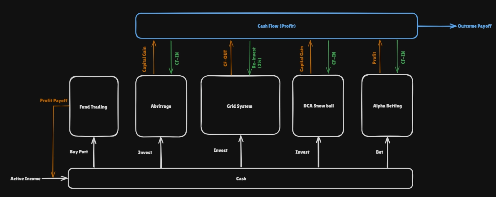
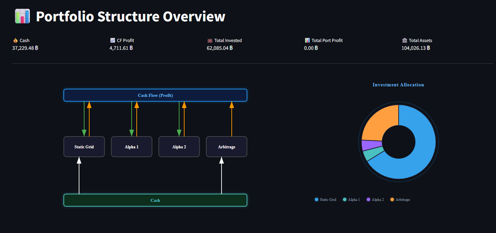
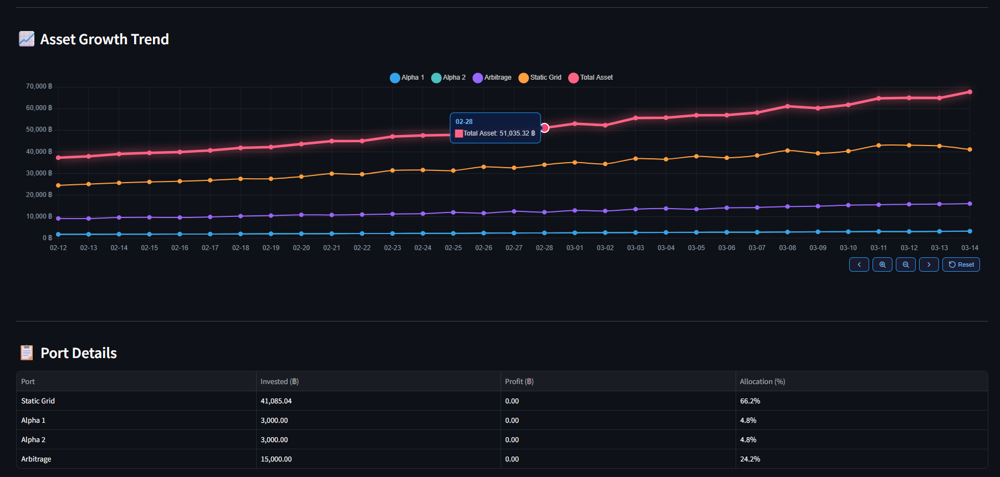
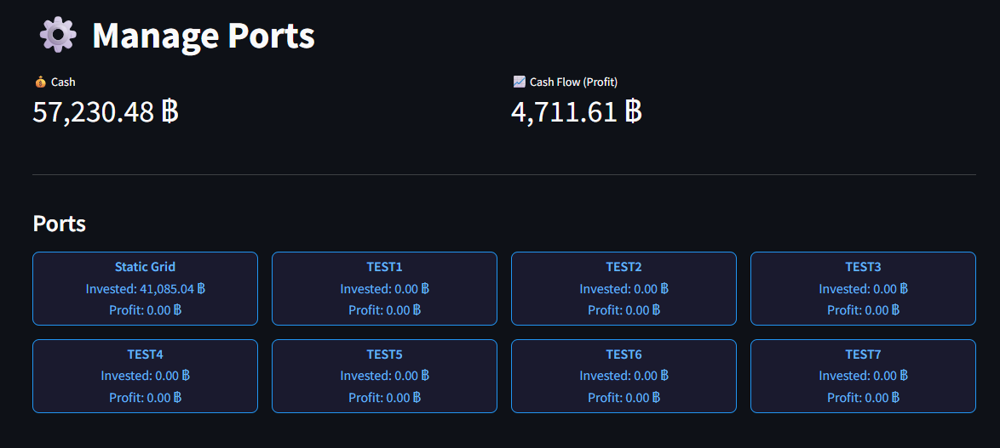
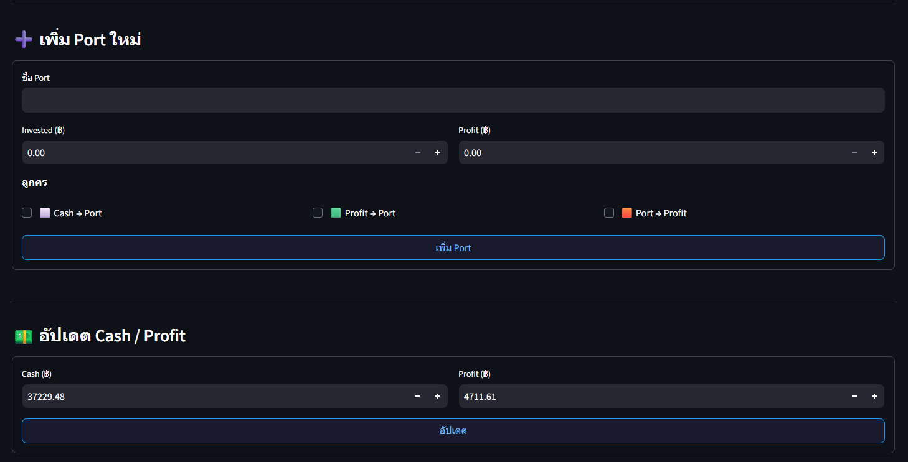
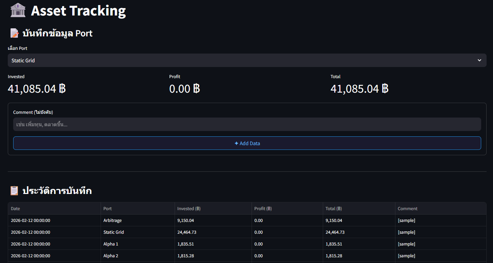
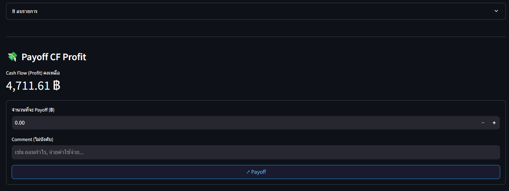

# 📊 Portfolio Structure

A web application for visualizing and managing investment portfolio structure.



## Features

- Dashboard overview of all ports with Pie Chart
- Relationship diagram between Cash, Ports and Cash Flow (Profit) with 3 arrow colors
  - ⬜ White: Cash → Port (initial investment)
  - 🟩 Green: Profit → Port (reinvestment from profit)
  - 🟧 Orange: Port → Profit (transfer profit out)
- Add / Delete ports (duplicate names not allowed)
- Edit Invested / Profit per port
- Transfer profit from Port to Cash Flow (Profit)
- Auto-deduct Cash when investing

## Tech Stack

- Backend: FastAPI + SQLAlchemy
- Frontend: Streamlit
- Database: PostgreSQL 16
- Container: Docker + Docker Compose

## Screenshots

### Overview Dashboard

<!-- Add Overview screenshot heree -->



### Manage Ports

<!-- Add Manage screenshot here -->



### Asset Tracking

<!-- Add Manage screenshot here -->



## Getting Started

### Prerequisites

- Docker & Docker Compose

### Setup

1. Clone the repository

```bash
git clone <repo-url>
cd Portfolio_Structure
```

2. Create `.env` from template

```bash
cp .env.example .env
```

3. Build and run

```bash
docker-compose up --build -d
```

4. Access the application

| Service | URL |
|---------|-----|
| Streamlit UI | http://localhost:8501 |
| FastAPI Docs | http://localhost:8000/docs |

## Project Structure

```
├── backend/
│   ├── database.py      # PostgreSQL connection
│   ├── models.py         # SQLAlchemy models
│   ├── schemas.py        # Pydantic schemas
│   └── main.py           # FastAPI endpoints
├── frontend/
│   ├── app.py            # Streamlit entry point
│   └── pages/
│       ├── overview.py   # Dashboard & diagram
│       └── manage.py     # Port management
├── scripts/
│   ├── backup.sh         # DB backup
│   └── restore.sh        # DB restore
├── docker-compose.yml
├── Dockerfile
├── .env.example
└── requirements.txt
```

## Backup & Restore

```bash
# Backup
bash scripts/backup.sh

# Restore
bash scripts/restore.sh backups/backup_20260314_120000.sql
```

## Unit Test

รัน unit test บนเครื่อง local (ไม่ต้องใช้ Docker หรือ PostgreSQL)

```bash
# ติดตั้ง dependencies
pip install -r requirements.txt

# รัน test
python -m pytest backend/tests/ -v

# Load Test Data Set
curl -X POST http://localhost:8000/asset-snapshots/seed-sample

# Delete Test Data Set
curl -X DELETE http://localhost:8000/asset-snapshots/seed-sample
```

## Environment Variables

| Variable | Description | Default |
|----------|-------------|---------|
| POSTGRES_USER | Database username | portfolio |
| POSTGRES_PASSWORD | Database password | portfolio |
| POSTGRES_DB | Database name | portfolio |
